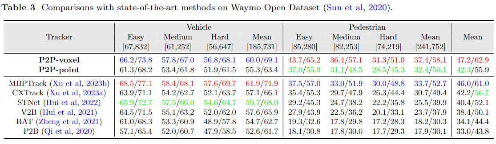

# P2P 

The official implementation of the paper: 

**P2P: Part-to-Part Motion Cues Guide a Strong Tracking Framework for LiDAR Point Clouds**

>  [Jiahao Nie](https://scholar.google.com/citations?user=R0uN6pcAAAAJ&hl=zh-CN), [Fei Xie](https://scholar.google.com/citations?user=GbGmwiwAAAAJ&hl=zh-CN&oi=ao), [Sifan Zhou](https://scholar.google.com/citations?user=kSdqoi0AAAAJ&hl=zh-CN&oi=ao), [Xueyi Zhou](https://scholar.google.com/citations?hl=zh-CN&user=YflJMZcAAAAJ), [Dong-Kyu Chae](https://scholar.google.com/citations?hl=zh-CN&user=cUkDvwQAAAAJ), [Zhiwei He](https://scholar.google.com/citations?user=OZkiufUAAAAJ&hl=zh-CN&oi=ao).
>
> 📜 [[technical report](https://arxiv.org/abs/2407.05238)], 🤗 [[model weights](https://drive.google.com/drive/folders/xx)]

<div id="top" align="center">
<p align="center">

</p>
</div>

## 🔥 Highlights

**P2P** is a strong tracking framework for 3D SOT on LiDAR point clouds that have:

- *Elegant tracking pipeline*.
- *SOTA performance on KITTI, NuScenes and Waymo*.
- *High efficiency*.

<div id="top" align="center">
<p align="center">

</p>
</div>

<div id="top" align="center">
<p align="center">

</p>
</div>

<div id="top" align="center">
<p align="center">

</p>
</div>

## 📢 News

> [!IMPORTANT]
> If you have any question for our codes or model weights, please feel free to concat me at jhnie@hdu.edu.cn.

- **[2024/07/10]** We released the arxiv version at [here](https://arxiv.org/abs/2407.05238).
- **[2024/07/07]** We released the installation, training, and testing details.
- **[2024/07/06]** We released the implementation of our model.

## 📋 TODO List

- [ ] All caterogy model weights of point and voxel versions trained on KITTI, Nuscenes.

## 🕹️ Getting Started

- [Installation](https://github.com/haooozi/P2P/tree/main/docs/INSTALL.md)

- [Data Preparation](https://github.com/haooozi/P2P/tree/main/docs/DATA.md)

- [Training](https://github.com/haooozi/P2P/tree/main/docs/TRAINING.md)

- [Testing](https://github.com/haooozi/P2P/tree/main/docs/TESTING.md)


## ❤️ Acknowledgement

Our implementation is based on [Open3DSOT](https://github.com/Ghostish/Open3DSOT), [BEVTrack](https://github.com/xmm-prio/BEVTrack) and [MMDetection3D](https://github.com/open-mmlab/mmdetection3d). Thanks for the great open-source work!

## ⭐ Citation

If any parts of our paper and code help your research, please consider citing us and giving a star to our repository.

```bibtex
@article{p2p,
 title={P2P: Part-to-Part Motion Cues Guide a Strong Tracking Framework for LiDAR Point Clouds},
 year={2024}
}
